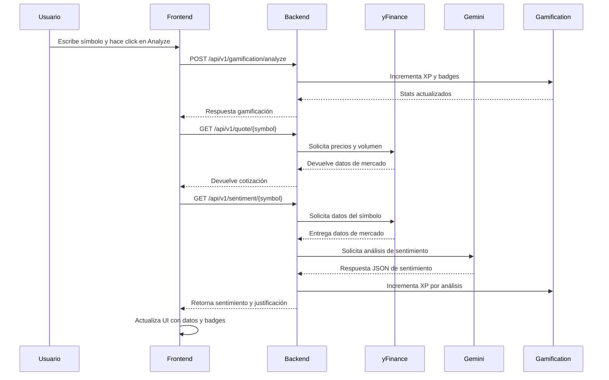
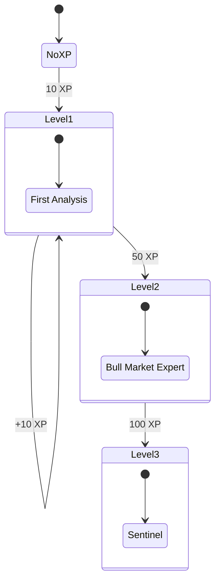

# Arquitectura de TraderPulse

TraderPulse está diseñado como un monorepo con un frontend en Next.js y un backend en FastAPI. La arquitectura separa claramente la experiencia del usuario de la lógica del negocio y los servicios externos.

## Diagrama de Componentes

```mermaid
graph TB
  subgraph Frontend
    UX[Dashboard UI]
    Sidebar[Sidebar]
    SearchBar[SearchBar]
    ResultCard[ResultCard]
    Context[GamificationContext]
  end

  subgraph Backend
    API[FastAPI API]
    QuoteRouter[/api/v1/quote]
    SentimentRouter[/api/v1/sentiment]
    GamificationRouter[/api/v1/gamification]
    YFinance[Service: yFinance]
    Gemini[Service: Gemini AI]
    GamificationService[Service: Gamification]
  end

  subgraph Infra
    Vercel[Vercel Frontend]
    CloudRun[Cloud Run Backend]
    SecretManager[Secret Manager]
    ArtifactRegistry[Artifact Registry]
  end

  UX --> |HTTP| API
  SearchBar --> Context
  ResultCard --> Context
  Sidebar --> Context
  API --> QuoteRouter
  API --> SentimentRouter
  API --> GamificationRouter
  QuoteRouter --> YFinance
  SentimentRouter --> YFinance
  SentimentRouter --> Gemini
  GamificationRouter --> GamificationService
  CloudRun --> API
  CloudRun --> SecretManager
  CloudRun --> ArtifactRegistry
  Vercel --> UX
```

## Flujo de datos

### Análisis de símbolo



## Flujo de gamificación



## Componentes clave

- **Frontend**
  - `Dashboard Page`: Página principal de análisis.
  - `Sidebar`: Muestra nivel, XP, barra de progreso y badges.
  - `SearchBar`: Formulario para buscar símbolos y disparar análisis.
  - `ResultCard`: Muestra precio, cambio y sentimiento.
  - `GamificationContext`: Persiste estado de XP/badges en la sesión.

- **Backend**
  - `main.py`: Configura FastAPI y CORS.
  - `routers/quote.py`: Endpoint `/api/v1/quote/{symbol}`.
  - `routers/sentiment.py`: Endpoint `/api/v1/sentiment/{symbol}`.
  - `routers/gamification.py`: Endpoints de gamificación.
  - `services/yfinance_service.py`: Lógica de consulta a yfinance.
  - `services/gemini_service.py`: Lógica de análisis con Gemini.
  - `services/gamification_service.py`: Almacenamiento en memoria de XP y badges.

## Infraestructura

- **Vercel**: Hospeda el frontend Next.js.
- **Google Cloud Run**: Hospeda el backend FastAPI.
- **Artifact Registry**: Almacena las imágenes Docker del backend.
- **Secret Manager**: Guarda `GEMINI_API_KEY`.
- **CORS**: Limitado a `FRONTEND_URL` configurado desde entorno.

## Decisiones arquitectónicas

- **Separación frontend/backend**: Monorepo con dos aplicaciones independientes.
- **Serverless**: Cloud Run para autoescalado y despliegue sencillo.
- **API-first**: Backend REST con rutas claras y documentación automática.
- **Gamificación simple**: Almacenamiento en memoria para MVP, escalable a Redis.
- **Componentes UI reutilizables**: shadcn/ui para consistencia visual.
- **Context API**: Mantiene estado global de gamificación con actualizaciones instantáneas.

## Extensiones futuras

- Persistencia de usuarios y análisis
- Autenticación y roles
- Cache y Redis para datos de precio
- Métricas y alertas en Cloud Monitoring
- Pruebas end-to-end con Playwright
- Microservicios adicionales para analítica avanzada
